# Mega Minecraft

**University of Pennsylvania, CIS 565: GPU Programming and Architecture, Final Project**

- [Aditya Gupta](https://adityag1.com/)
- [Helena Zhang](https://TODO.com/)
- [Alan Qiao](https://TODO.com/)

## Overview

	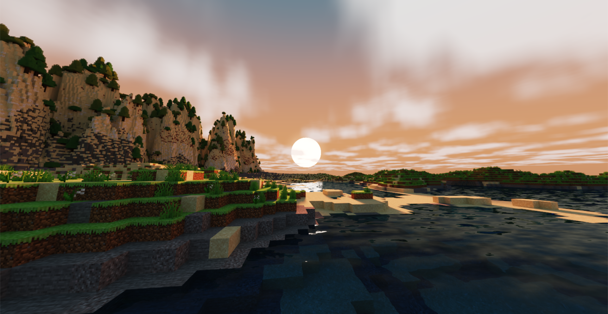

This project aims to recreate Minecraft with two major upgrades: **real-time path tracing** with OptiX and **GPU-accelerated terrain generation** with CUDA.

TODO: expand on this

## OptiX Path Tracing

TODO: Alan and Helena

maybe copy the optix/directx flowchart into here

### Base path tracer

TODO: Alan and Helena

### Optimizations

TODO: Alan

### Sky

TODO: Aditya

### Denoising

TODO: Alan

## CUDA Terrain Generation

TODO: Aditya

briefly explain chunk-based generation

potentially add a diagram explaining the entire chunk kernel/gathering process

also explain action time system

Unless otherwise specified, all terrain generation steps other than gathering neighboring chunks are performed on the GPU using CUDA kernels.

### Heightfields and surface biomes

The first step for a chunk is generating heightfields and surface biomes. Surface biomes consider only X and Z position, while cave biomes (discussed later) also take Y into account. All biomes are placed depending on multiple attributes, such as moisture, temperature, and rockiness, which are decided using noise functions. For example, the jungle surface biome corresponds to columns of terrain that are not ocean or beach, are hot, moist, and magical, and are not rocky. These noise functions also allow for smooth interpolation between biomes, such that the weights of all surface biomes and the weights of all cave biomes each add up to 1. Since each column's biomes and height are independent of all other columns, this process lends itself very well to GPU parallelization.

Biomes determine not only which blocks are placed, but also the terrain's height and which terrain features are created. For example, while the redwood forest biome has grass and redwood trees, the rocky beach biome has gravel and no notable terrain features. Both biomes also have relatively similar heightfields. These characteristics are blended in boundary areas using each biome's respective weight.

  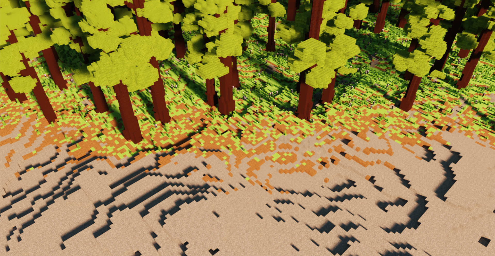
   
  <em>As the two biomes blend, their blocks also mix.</em>

The height and biome weights of each column are stored for later use.

### Erosion

After heights and surface biomes are decided, the next step is to generate terrain layers and perform an erosion simulation. Our technique is based on [Procedural Generation of Volumetric Data for Terrain](https://www.diva-portal.org/smash/get/diva2:1355216/FULLTEXT01.pdf) (Machado 2019). First, layers of various materials (stone, dirt, sand, etc.) are generated using fBm noise functions. Each layer has parameters for base height and variation, and different biomes can also assign more or less weight to different layers. Layer heights are also smoothly interpolated between surface biomes based on the biomes' weights.

  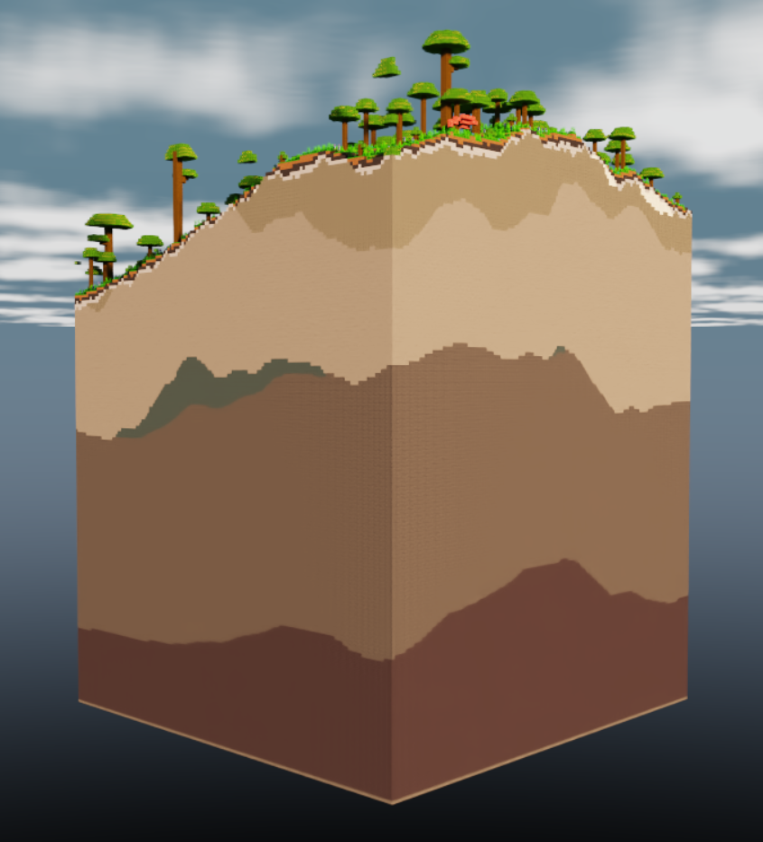
   
  <em>A section of 9x9 chunks showing various layers.</em>

The top layers are "loose" and consist of materials like dirt, sand, and gravel. Loose layers' heights are determined in part by the terrain's slope, which requires gathering the 8 surrounding chunks of each chunk in order to determine the slope of the chunk's edges. Once all layers are placed, erosion proceeds starting from the lowest loose layer and going up to the highest. Rather than a traditional erosion simulation, which moves material from a column to its surrounding columns, we use Machado's proposed "slope method", which removes material from a column if it has too high of a difference in layer heights from its surrounding columns.

  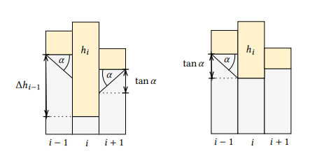
   
  <em>Illustration of the slope method, where</em> α <em>is the maximum angle between neighboring layers (defined per material).</em>

The process is repeated until the terrain no longer changes. However, since erosion of a specified area relies on surrounding terrain data as well, performing this process on a chunk-by-chunk basis would lead to discontinuities. For that reason, we gather an entire 12x12 "zone" of chunks, as well as a further 6 chunks of padding on each side, before performing erosion on the entire 24x24 chunk area. Afterwards, we keep the eroded data for the center zone while discarding that of the padding chunks.

Erosion leads to more natural looking terrain, especially in steep areas. For example, in the jungle biome, erosion exposes subterranean stone in hilly areas while mostly ignoring relatively flat areas.

  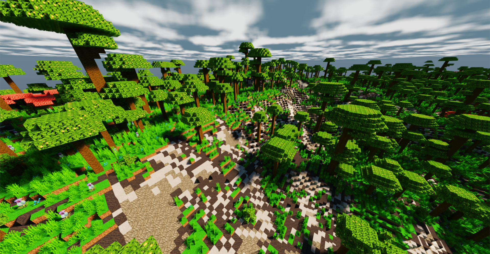
   
  <em>Notice how the relatively flat left side is mostly grassy while the steeper right side has much more exposed stone.</em>

### Caves and cave biomes

Once terrain erosion has completed, caves are carved out of the terrain. The main caves are heavily inspired by a Minecraft mod called [Worley's Caves](https://www.curseforge.com/minecraft/mc-mods/worleys-caves). True to their name, these caves use a modified version of Worley noise to generate infinite branching tunnels and large open areas. Most of the caves are hidden fully underground, but ravines spread out throughout the terrain provide access to the subterranean world.

  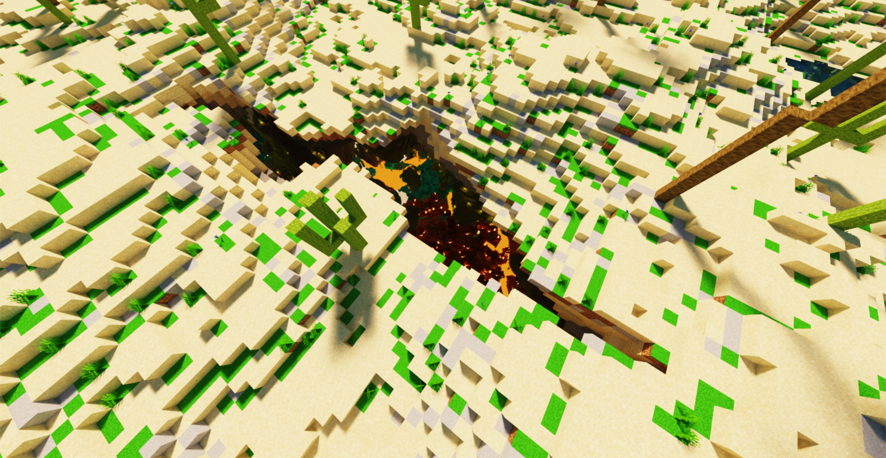
   
  <em>A relatively small opening...</em>

  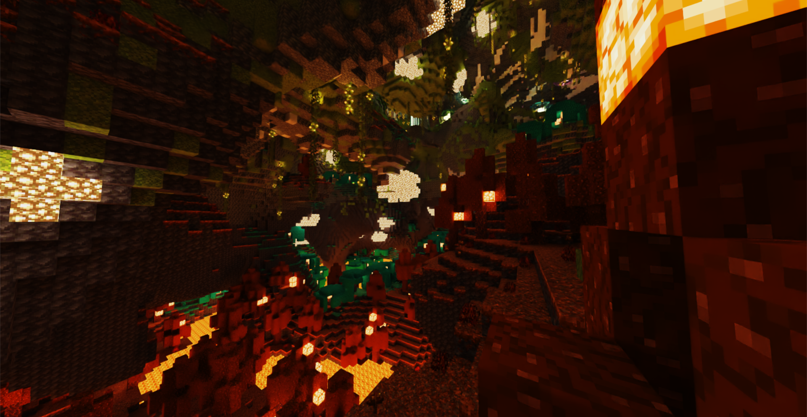
   
  <em>...can lead to a huge cave!</em>

The cave generation kernel first determines whether each block is in a cave, then it flattens that information into "cave layers". A cave layer describes a contiguous vertical section of air in a single terrain column. Each layer has a start and and an end, as well as a start cave biome and an end cave biome. Cave biomes are determined in a similar fashion to surface biomes, except some cave biome attributes also take Y position into account. Each cave layer's biome is chosen at random, with each biome's weight serving as its chance of being chosen.

Flattening the 3D information into layers allows for easily querying the start, end, height, and biomes of any layer, which is essential for placing cave features (described in the next section).

  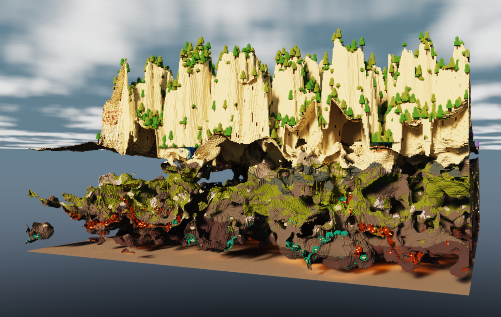
   
  <em>Side view of some caves.</em>

### Terrain features

At this point, the surface height, each cave layer's start and end height, and all biomes have been decided. The next step is to place terrain features, which is done on the CPU due to the inability to predetermine how many features a chunk will contain. 

Each feature type has its own uniform grid with varying cell size and cell padding. For example, large purple mushrooms have a cell size of 10 and a padding of 2, meaning that each mushroom is placed at a random point in the center 6x6 area of a 10x10 grid cell. Each cell also has a certain chance of actually containing the feature, which helps give a more random appearance to the placements. For large purple mushrooms, the chance is 50%.

Each biome has its own set of feature generations. To place surface features, for each column of terrain, we first pick a random surface biome at random based on that column's biome weights. Then, for each of that biome's feature generations, we check whether any of them would generate a feature at exactly the current column's position, and if so, we place the feature on the current column with the chance set by the feature generation. Cave features are placed in a similar manner, except some of them generate from the ceiling as well. Cave feature generation uses the randomly predetermined cave biome of each cave layer instead of calculating a new random cave biome.

Since features can cross chunk boundaries, the last step is to gather the features of this chunk and surrounding chunks into one list to send to the final chunk fill kernel. Currently, the radius is set to 3 chunks, so features should be no more than 48 blocks wide.

### Chunk fill

TODO: Aditya

## Gallery

Sections are organized in chronological order.

Terrain rendered with OpenGL

 
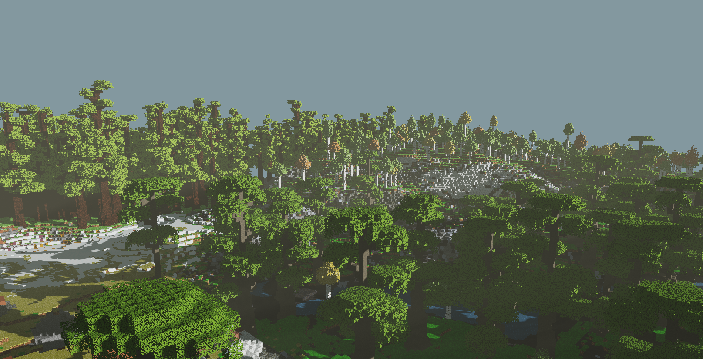
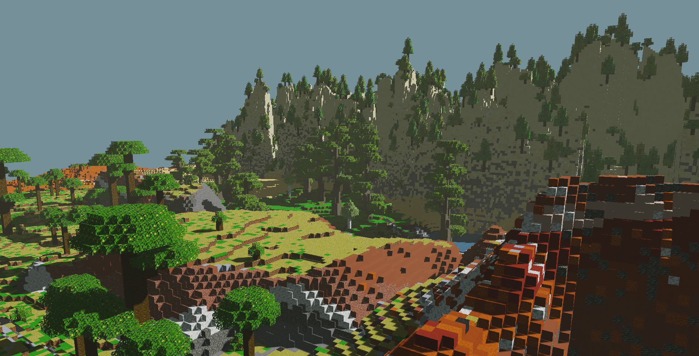
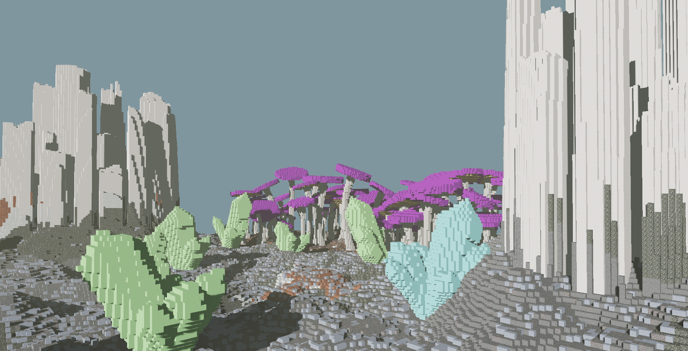
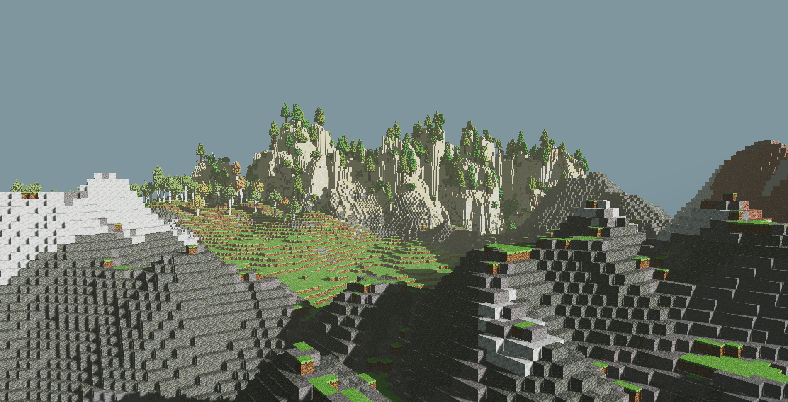

First path traced results

 
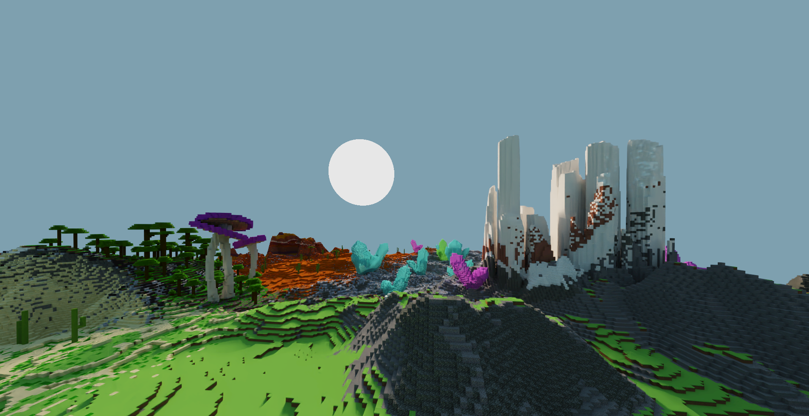
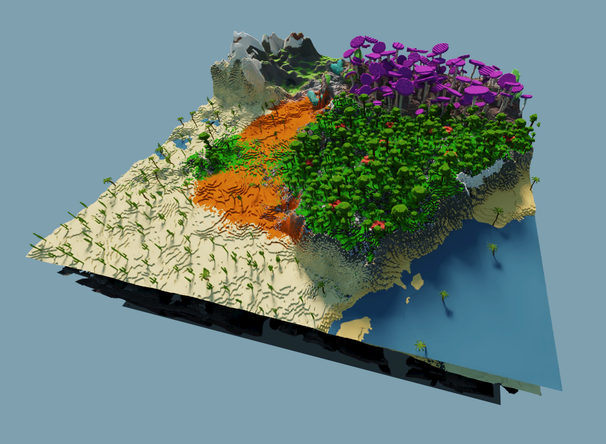

Caves

 
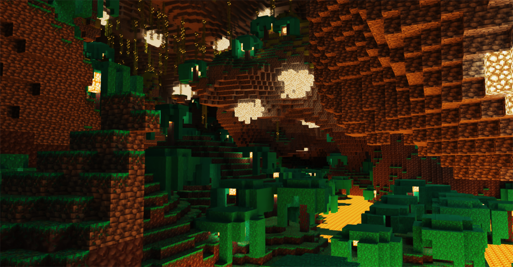
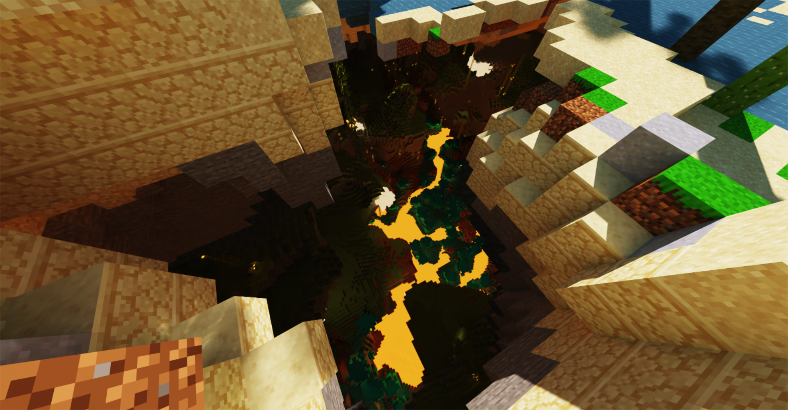
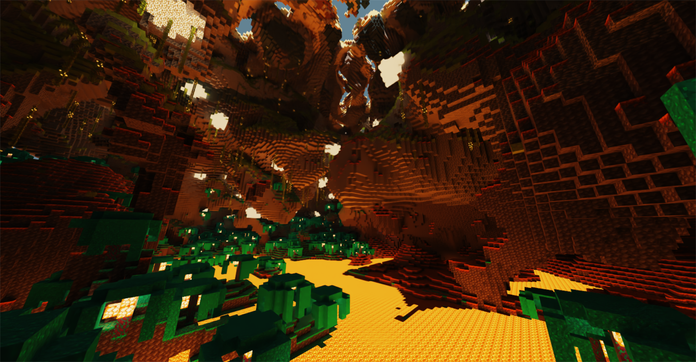

Reflections and sky

 
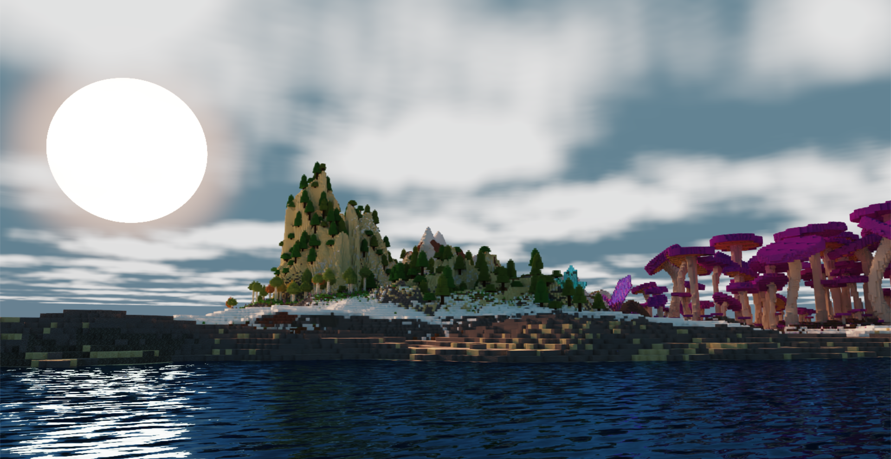

## References

TODO

-
-
-
-
-

## Special Thanks

TODO

detlef lol