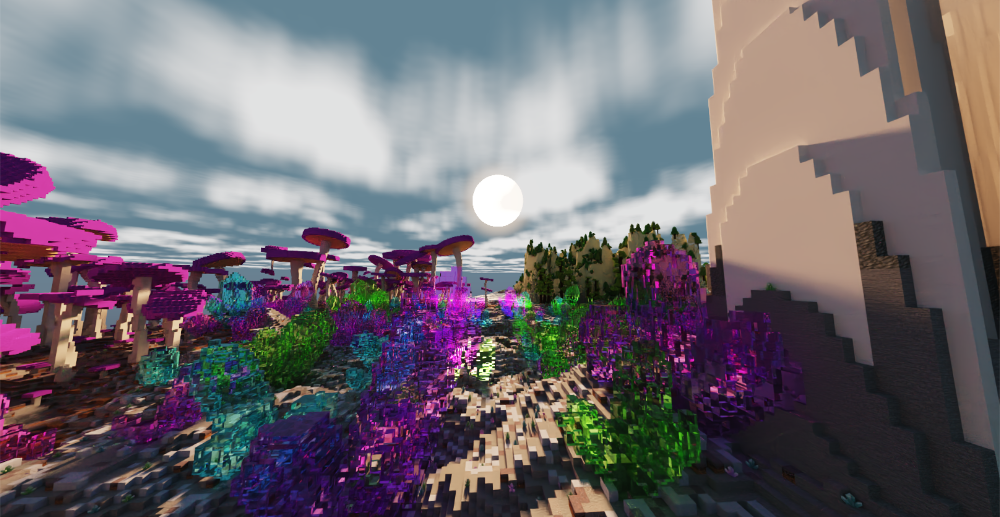

# Mega Minecraft

**University of Pennsylvania, CIS 565: GPU Programming and Architecture, Final Project**

- [Aditya Gupta](https://adityag1.com/)
- [Helena Zhang](https://TODO.com/)
- [Alan Qiao](https://github.com/alan-qiao)

## Overview

	

This project aims to create a Minecraft-like experience with two major upgrades: **GPU-accelerated terrain generation** with CUDA and **real-time path tracing** with OptiX.

TODO: expand on this

## CUDA Terrain Generation

TODO: Aditya

briefly explain chunk-based generation

potentially add a diagram explaining the entire chunk kernel/gathering process

also explain action time system

Unless otherwise specified, all terrain generation steps other than gathering neighboring chunks are performed on the GPU using CUDA kernels.

### Heightfields and surface biomes

The first step for a chunk is generating heightfields and surface biomes. Surface biomes consider only X and Z position, while cave biomes (discussed later) also take Y into account. All biomes are placed depending on multiple attributes, such as moisture, temperature, and rockiness, which are decided using noise functions. For example, the jungle surface biome corresponds to columns of terrain that are not ocean or beach, are hot, moist, and magical, and are not rocky. These noise functions also allow for smooth interpolation between biomes, such that the weights of all surface biomes and the weights of all cave biomes each add up to 1. Since each column's biomes and height are independent of all other columns, this process lends itself very well to GPU parallelization.

Biomes determine not only which blocks are placed, but also the terrain's height and which terrain features are created. For example, while the redwood forest biome has grass and redwood trees, the rocky beach biome has gravel and no notable terrain features. Both biomes also have relatively similar heightfields. These characteristics are blended in boundary areas using each biome's respective weight.

  
   
  <em>As the two biomes blend, their blocks also mix.</em>

The height and biome weights of each column are stored for later use.

### Erosion

After heights and surface biomes are decided, the next step is to generate terrain layers and perform an erosion simulation. Our technique is based on [Procedural Generation of Volumetric Data for Terrain](https://www.diva-portal.org/smash/get/diva2:1355216/FULLTEXT01.pdf) (Machado 2019). First, layers of various materials (stone, dirt, sand, etc.) are generated using fBm noise functions. Each layer has parameters for base height and variation, and different biomes can also assign more or less weight to different layers. Layer heights are also smoothly interpolated between surface biomes based on the biomes' weights.

  
   
  <em>A section of 9x9 chunks showing various layers.</em>

The top layers are "loose" and consist of materials like dirt, sand, and gravel. Loose layers' heights are determined in part by the terrain's slope, which requires gathering the 8 surrounding chunks of each chunk in order to determine the slope of the chunk's edges. Once all layers are placed, erosion proceeds starting from the lowest loose layer and going up to the highest. Rather than a traditional erosion simulation, which moves material from a column to its surrounding columns, we use Machado's proposed "slope method", which removes material from a column if it has too high of a difference in layer heights from its surrounding columns.

  
   
  <em>Illustration of the slope method, where</em> α <em>is the maximum angle between neighboring layers (defined per material).</em>

The process is repeated until the terrain no longer changes. However, since erosion of a specified area relies on surrounding terrain data as well, performing this process on a chunk-by-chunk basis would lead to discontinuities. For that reason, we gather an entire 12x12 "zone" of chunks, as well as a further 6 chunks of padding on each side, before performing erosion on the entire 24x24 chunk area. Afterwards, we keep the eroded data for the center zone while discarding that of the padding chunks.

Erosion leads to more natural looking terrain, especially in steep areas. For example, in the jungle biome, erosion exposes subterranean stone in hilly areas while mostly ignoring relatively flat areas.

  
   
  <em>Notice how the relatively flat left side is mostly grassy while the steeper right side has much more exposed stone.</em>

### Caves and cave biomes

Once terrain erosion has completed, caves are carved out of the terrain. The main caves are heavily inspired by a Minecraft mod called [Worley's Caves](https://www.curseforge.com/minecraft/mc-mods/worleys-caves). True to their name, these caves use a modified version of Worley noise to generate infinite branching tunnels and large open areas. Most of the caves are hidden fully underground, but ravines located throughout the terrain provide access to the subterranean world.

  
   
  <em>A relatively small opening...</em>

  
   
  <em>...can lead to a huge cave!</em>

The cave generation kernel first determines whether each block is in a cave, then it flattens that information into "cave layers". A cave layer describes a contiguous vertical section of air in a single terrain column. Each layer has a start and and an end, as well as a start cave biome and an end cave biome. Cave biomes are determined in a similar fashion to surface biomes, except some cave biome attributes also take Y position into account. Each cave layer's biome is chosen at random, with each biome's weight serving as its chance of being chosen.

Flattening the 3D information into layers allows for easily querying the start, end, height, and biomes of any layer, which is essential for placing cave features (described in the next section).

  
   
  <em>Side view of some caves.</em>

### Terrain features

At this point, the surface height, each cave layer's start and end height, and all biomes have been decided. The next step is to place terrain features, which is done on the CPU due to the inability to predetermine how many features a chunk will contain. 

Each feature type has its own uniform grid with varying cell size and cell padding. For example, large purple mushrooms have a cell size of 10 and a padding of 2, meaning that each mushroom is placed at a random point in the center 6x6 area of a 10x10 grid cell. Each cell also has a certain chance of actually containing the feature, which helps give a more random appearance to the placements. For large purple mushrooms, the chance is 50%.

  
   
  <em>Continuing the purple mushrooms example, each grid cell (outlined by black borders) represents 10x10 blocks. Gray areas are padding and purple dots are feature placements.</em>

Feature generators also contain lists of acceptable top layers so that, for example, trees are not placed on stone. For purple mushrooms, the only acceptable top layer is dirt at a thickness of at least 0.3. Even though the final top block in the biome is mycelium, the actual terrain layer is dirt and the mycelium is placed in the postprocessing step, meaning mushrooms will end up being placed on mycelium.

Each biome has its own set of feature generators. To place surface features, for each column of terrain, we first pick a random surface biome at random based on that column's biome weights. Then, for each of that biome's feature generators, we check whether any of them would generate a feature at exactly the current column's position, and if so, we place the feature on the current column with the chance set by the feature generation. Cave features are placed in a similar manner, except some of them generate from the ceiling as well. Cave feature generation uses the randomly predetermined cave biome of each cave layer instead of calculating a new random cave biome.

Since features can cross chunk boundaries, the last step is to gather the features of this chunk and surrounding chunks into one list to send to the final chunk fill kernel. Currently, the radius is set to 3 chunks, so features should be no more than 48 blocks wide.

### Chunk fill

The only thing left now is to actually fill the chunk's blocks. This step takes in various inputs:

- Heightfield
- Biome weights
- Terrain layers
- Cave layers
- Feature placements

If a block is below its column's height, it is filled in with a block depending its corresponding terrain layer. If the block is in a cave layer, it will instead be filled with air. After the layers are filled out, some biomes also apply special post-processing functions. For example, the frozen wasteland biome turns water into ice while the mesa biome places layers of colorful terracotta. As with all other biome-related processes, these too are interpolated across biome boundaries using biome weights.

After the base terrain has been constructed, terrain features are filled in. Each thread loops over all gathered features and places the first one found at the current position. Feature placement makes use of many early exit conditions to ensure that a thread does not performing intensive calculations for features which are nowhere near its position.

  
   
  <em>Various features placed across multiple different biomes.</em>

Once all features are placed, the blocks are copied from the GPU to the CPU. Then, the last step is placing "decorators", which are blocks like flowers and small mushrooms. This is done on the CPU due to the potentially different number of positions to check for decorator placement in each column. Each biome has a set of decorator generators, each containing a chance per block, allowed bottom blocks (e.g. grass for flowers), allowed blocks to replace (usually air but can be water for ocean decorators), and optionally a second block for decorators that are two blocks tall. Some decorators, like crystals in the crystal caves, can even generate hanging from the ceiling.

  
   
  <em>Decorators in the lush birch forest biome, including grass, dandelions, peonies, and lilacs.</em>

Once decorators are placed, the chunk's block data is fully complete. All that remains is creating vertices from the blocks and sending those to the GPU to construct acceleration structures.

## OptiX Path Tracing

TODO: Alan and Helena

To efficiently render the terrain in a reaslistic fashion, this project uses a hardware-accelerated Path Tracing that supports \[list features here\]. For better performance optimization across different compatible compute devices, the path tracer is built using Nvidia OptiX 8.0 is for maximal usage of Ray Tracing Cores. The final pixel image is then rasterized through DirectX 11 that selects on start the latest supported version of DirectX 11 implementation to maximize rasterization performance. The application window and controls are implemented using the Windows API for maximal compatibility with the DirectX 11 renderer.

  
   
  <em>Flowchart outlining Application Process and API segmentation</em>

As shown in the flowchart above, a typical cycle or frame of this application starts from processing any application messages. If an application message is received, it will trigger a corresponding scene state update, which may be a player movement, window resize, zoom adjustment, or camera rotation. All of these events may result in an update in the visible region, in which case the terrain generation process for the newly visible chunks are dispatched. Once chunk generation is complete, it would then trigger an update to the acceleration structures that the OptiX Ray Tracer checks for objects to trace. Regardless of whether new chunks are generated, the Path Tracing procedure would then be launched to determine what is currently visible to the camera, and send the accumulated noisy image to the denoiser with other guiding information. The final denoised output is then transferred to DirectX 11 for access through a fullscreen texture, which is then render as a textured rectangle that covers the entire application screen.

### Base path tracer

TODO: Alan and Helena

### Optimizations

TODO: Alan

### Sky

TODO: Aditya

  
   
  <em>The sun sets over an oasis.</em>

  
   
  <em>Shadowy fungi against a starry night sky.</em>

### Denoising

TODO: Alan
There are three denoisers supported in this program. The OptiX AOV Denoiser offers most detailed static output and is compatible with both OpenGL and DirectX 11 renderer. The OptiX 2X Upscaling Denoiser is the least resource intensive and compatible with both renders, but suffers from lower output quality. The Nivdia Real-time Denoiser offers the best dynamic outcome, but is only compatible with the DirectX 11 renderer and performs worth than OptiX AOV when static. This section will provide a brief overview of how each denoiser works and the render outcomes. For more details on the denoisers, please refer to the official API documentations, linked below in the reference section.

#### OptiX AOV

#### OptiX 2X Upscaling AOV

#### Nvidia Real-time Denoiser (NDR)

## Gallery

Sections are organized in chronological order.

Terrain rendered with OpenGL

 

First path traced results

 

Caves

 

Reflections and sky

 

## References

TODO

- [Procedural Generation of Volumetric Data for Terrain](https://www.diva-portal.org/smash/get/diva2:1355216/FULLTEXT01.pdf) (Machado 2019)
- [Worley's Caves](https://www.curseforge.com/minecraft/mc-mods/worleys-caves)
- [<em>Physically Based Rendering: From Theory to Implementation</em>](https://pbrt.org/)
- [Ingo Wald's OptiX 7 course](https://github.com/ingowald/optix7course)

## Special Thanks

TODO

- [Detlef Roettger](https://forums.developer.nvidia.com/u/droettger/) for giving invaluable OptiX advice and looking through our codebase
- [Eric Haines](https://erich.realtimerendering.com/) for putting us in contact with Detlef
- [Henrique Furtado Machado](https://www.linkedin.com/in/henriquefur/) for discussing the details of his paper with us
- [Wayne Wu](https://www.wuwayne.com/), [Shehzan Mohammed](https://www.linkedin.com/in/shehzan-mohammed/), and the TAs for teaching CIS 5650
- [Adam Mally](https://www.linkedin.com/in/adam-mally-888b912b/) for assigning the original Mini Minecraft project
