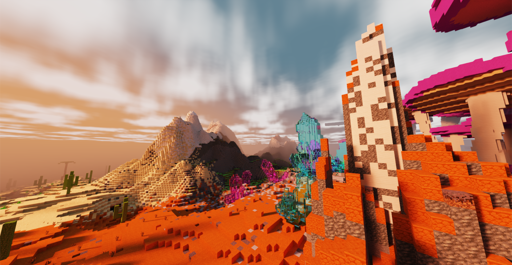
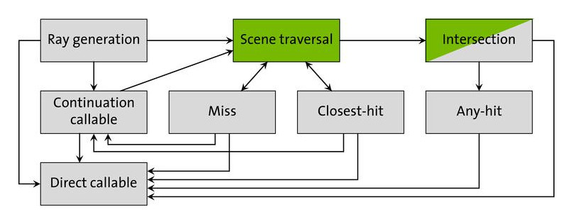
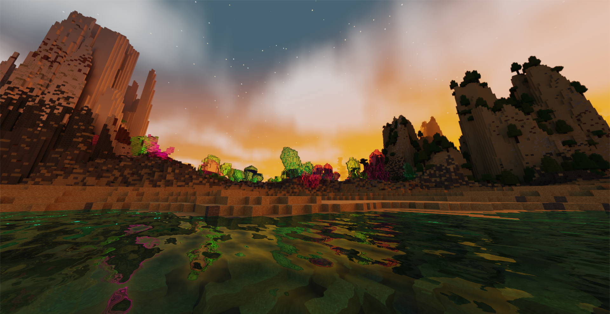
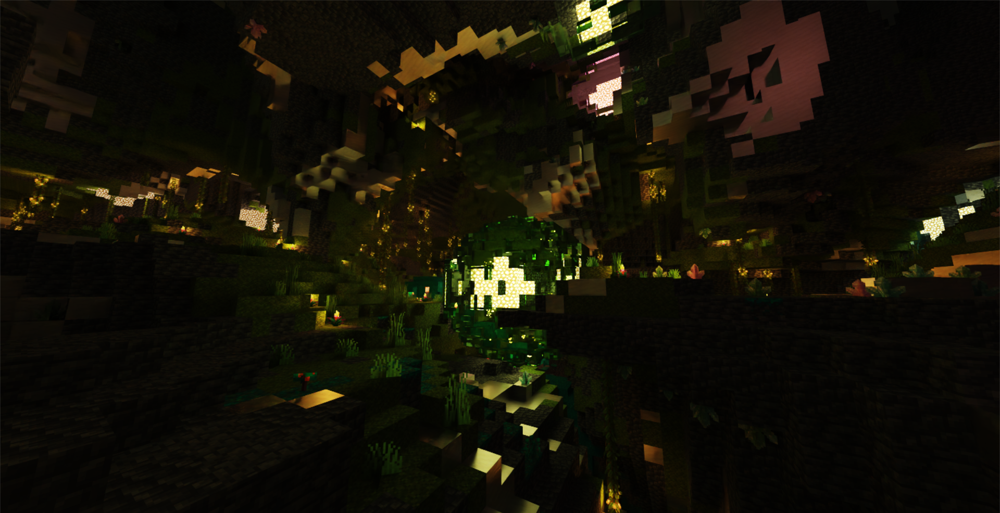
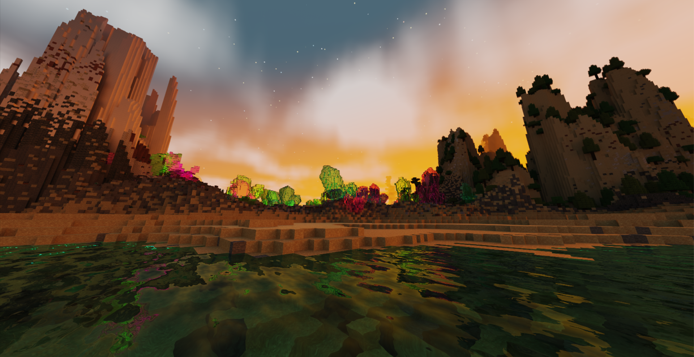
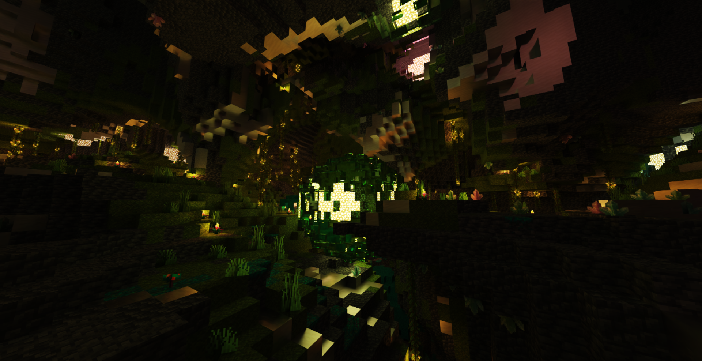
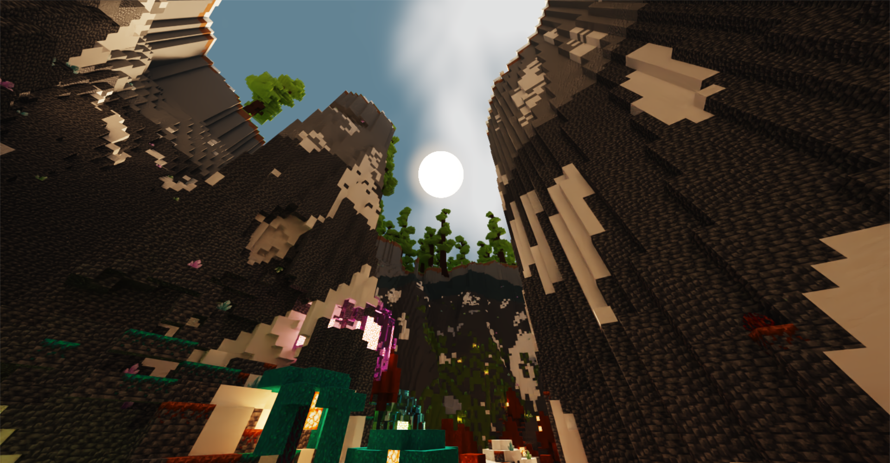
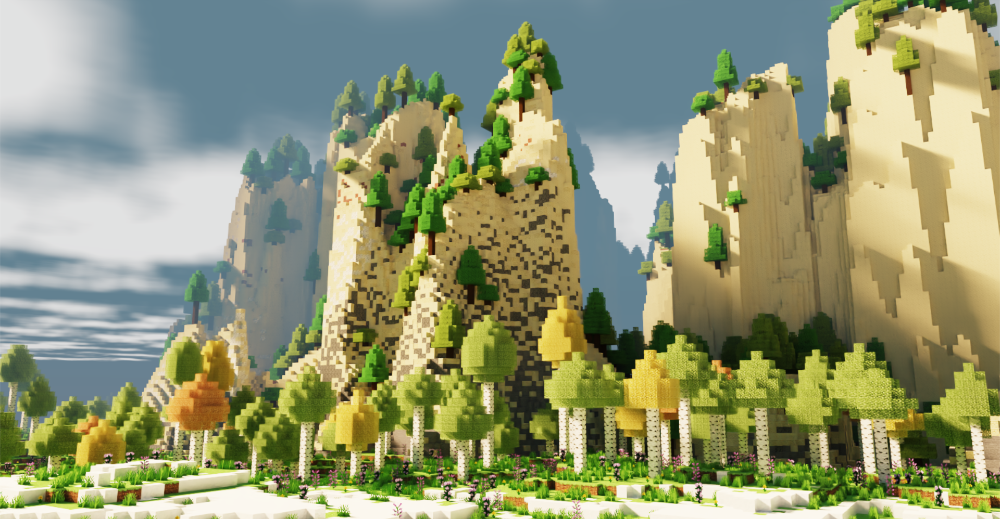
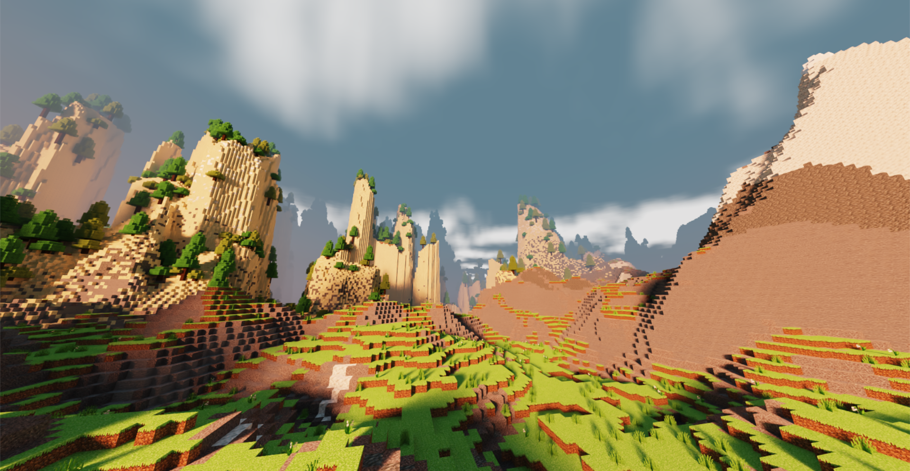
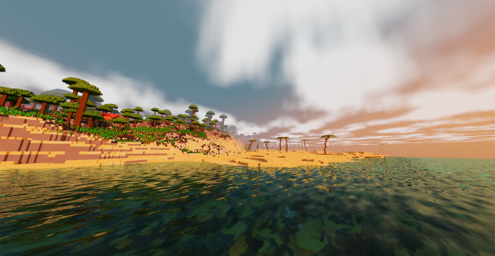

# Mega Minecraft

**University of Pennsylvania, CIS 565: GPU Programming and Architecture, Final Project**

- [Aditya Gupta](https://adityag1.com/)
- [Helena Zhang](https://TODO.com/)
- [Alan Qiao](https://github.com/alan-qiao)

## Overview

Video demo: https://youtu.be/-jJlK3-Xo-Q

Presentations: [pitch](https://docs.google.com/presentation/d/1diNXEq5zh7sp-kLlicTRt6OauGhyoBQNioDrIS7CHgw/edit?usp=drive_link), [milestone 1](https://docs.google.com/presentation/d/1w-iPBXFwFRybcw83rd-0xASlZbd4SomW0N69Pd39GI8/edit?usp=drive_link), [milestone 2](https://docs.google.com/presentation/d/1ijMXoqlIA5VvDqb1u5g5c89ef7WNxHP0v6aBaLHurk0/edit?usp=drive_link), [milestone 3](https://docs.google.com/presentation/d/1v4xKOEgfSngcHueTKa6YUtCG71jlRXH6r8Zsi7kEJ9g/edit?usp=drive_link), [final](https://docs.google.com/presentation/d/1hJqihCJB2vvmbETzr0PaqVKXA8CzNjkt8WNAU2PxQN0/edit?usp=drive_link)

This project aims to recreate Minecraft with two major upgrades: <ins>real-time path tracing</ins> with OptiX and <ins>GPU-accelerated terrain generation</ins> with CUDA.

Minecraft is rendered by rasterization and a block-based lighting system, which works very well for gameplay. Minecraft shaders take that to the next level by introducing features such as shadow mapping, screen space reflections, and dynamic lighting. This project goes one step further by using the RTX accelerated OptiX framework to perform rendering entirely through path tracing, which gives realistic lighting, shadows, and reflections.

Additionally, GPGPU programming with CUDA allows for fast generation of fantastical terrain constructed from various noise functions and implicit surfaces. This project's terrain consists of several distinct biomes, each with their own characteristics and structures. Players exploring the world can find sights such as giant purple mushrooms, vast expanses of sand dunes, infected underground forests, and many more.

This README gives an overview of the various parts of the project as well as more detailed explanations of individual features.

### Controls

When you run the project, there are a number of controls at your disposal.

- `WASD` for horizontal movement
- `Q` to fly down, `E` or `space` to fly up
- Mouse to look around
- `LShift` to fly faster
- `Z` to toggle arrow key controls, which replace the mouse for looking around
- Hold `C` to zoom in
- `P` to pause/unpause time
- `[` and `]` to step backwards and forwards in time
- `F` to toggle free cam mode, which disables generation of new chunks and unloading of far chunks

## CUDA Terrain Generation

While an infinite procedural world is one of Minecraft's selling point, terrain has to be generated in discrete sections called "chunks". In normal Minecraft and in this project, a chunk consists of 16x384x16 blocks. As the player moves around the world, new chunks are generated while old chunks are removed from view.

Chunk generation in this project consists of several steps:

- Heightfields and surface biomes
- Terrain layers and erosion
- Caves and cave biomes
- Terrain feature placement
  - This includes trees, mushrooms, crystals, etc.
- Chunk fill

Some steps, such as heightfields and surface biomes, can be performed on single chunks without any information about neighboring chunks. However, some steps, such as terrain layers and erosion, require gathering information from neighboring chunks in order to prevent discontinuities along chunk borders. The following dropdown sections explain the requirements for each step:

Heightfields and surface biomes

 
<em>Generating heightfields and surface biomes considers only a single 16x16 chunk (blue).</em>
 &nbsp;

Terrain layers

 
<em>Generating terrain layers requires gathering some padding data (orange) from surrounding chunks to calculate the slope of this chunk's heightfield (blue).</em>
 &nbsp;

Erosion

 
<em>Erosion considers a 12x12 zone of chunks (green) with 6 chunks of padding on each side (purple).</em>
 &nbsp;

Caves and cave biomes

 
<em>Like for heightfields and surface biomes, generating caves and cave biomes considers only a single chunk (blue).</em>
 &nbsp;

Terrain feature placement

 
<em>For generating terrain features, each chunk considers itself (green) and all chunks up to 3 chunks away (purple).</em>
 &nbsp;

Chunk fill

 
<em>Once all data has been gathered, this step fills an entire chunk (blue) with one kernel call.</em>

 

To balance the load over time and prevent lag spikes, we use an "action time" system for scheduling. Every frame, the terrain generator gains action time proportional to the time since the last frame. Action time per frame is capped at a certain amount to ensure that no one frame does too much work. Each action has an associated cost, determined by empirical measurements of the step's average duration, which subtracts from the accumulated action time. For example, we currently accumulate up to 30,000 action time per second and allow up to 500 action time per frame. Generating a chunk's heightfield and surface biomes is relatively inexpensive, so its cost is only 3 per chunk. However, erosion is run over a 24x24 area of chunks at once and is relatively expensive, so its cost is a full 500 per 24x24 area.

Unless otherwise specified, all terrain generation steps other than gathering data from neighboring chunks are performed on the GPU using CUDA kernels.

### Heightfields and surface biomes

The first step for a chunk is generating heightfields and surface biomes. Surface biomes consider only X and Z position, while cave biomes (discussed later) also take Y into account. All biomes are placed depending on multiple attributes, such as moisture, temperature, and rockiness, which are decided using noise functions. For example, the jungle surface biome corresponds to columns of terrain that are not ocean or beach, are hot, moist, and magical, and are not rocky. These noise functions also allow for smooth interpolation between biomes, such that the weights of all surface biomes and the weights of all cave biomes each add up to 1. Since each column's biomes and height are independent of all other columns, this process lends itself very well to GPU parallelization.

Biomes determine not only which blocks are placed, but also the terrain's height and which terrain features are created. For example, while the redwood forest biome has grass and redwood trees, the rocky beach biome has gravel and no notable terrain features. Both biomes also have relatively similar heightfields. These characteristics are blended in boundary areas using each biome's respective weight.

  
   
  <em>As the two biomes blend, their blocks also mix.</em>

The height and biome weights of each column are stored for later use.

### Terrain layers and erosion

After heights and surface biomes are decided, the next step is to generate terrain layers and perform an erosion simulation. Our technique is based on [Procedural Generation of Volumetric Data for Terrain](https://www.diva-portal.org/smash/get/diva2:1355216/FULLTEXT01.pdf) (Machado 2019). First, layers of various materials (stone, dirt, sand, etc.) are generated using fBm noise functions. Each layer has parameters for base height and variation, and different biomes can also assign more or less weight to different layers. Layer heights are also smoothly interpolated between surface biomes based on the biomes' weights.

  
   
  <em>A section of 9x9 chunks showing various layers.</em>

The top layers are "loose" and consist of materials like dirt, sand, and gravel. Loose layers' heights are determined in part by the terrain's slope, which requires gathering the 8 surrounding chunks of each chunk in order to determine the slope of the chunk's edges. Once all layers are placed, erosion proceeds starting from the lowest loose layer and going up to the highest. Rather than a traditional erosion simulation, which moves material from a column to its surrounding columns, we use Machado's proposed "slope method", which removes material from a column if it has too high of a difference in layer heights from its surrounding columns.

  
   
  <em>Illustration from the paper of the slope method, where</em> α <em>is the maximum angle between neighboring layers (defined per material).</em>

The process is repeated until the terrain no longer changes. However, since erosion of a specified area relies on surrounding terrain data as well, performing this process on a chunk-by-chunk basis would lead to discontinuities. For that reason, we gather an entire 12x12 "zone" of chunks, as well as a further 6 chunks of padding on each side, before performing erosion on the entire 24x24 chunk area. Afterwards, we keep the eroded data for the center zone while discarding that of the padding chunks.

Erosion leads to more natural looking terrain, especially in steep areas. For example, in the jungle biome, erosion exposes subterranean stone in hilly areas while mostly ignoring relatively flat areas.

  
   
  <em>Notice how the relatively flat left side is mostly grassy while the steeper right side has much more exposed stone.</em>

### Caves and cave biomes

Once terrain erosion has completed, caves are carved out of the terrain. The main caves are heavily inspired by a Minecraft mod called [Worley's Caves](https://www.curseforge.com/minecraft/mc-mods/worleys-caves). True to their name, these caves use a modified version of Worley noise to generate infinite branching tunnels and large open areas. Most of the caves are hidden fully underground, but ravines located throughout the terrain provide access to the subterranean world.

  
   
  <em>A relatively small opening...</em>

  
   
  <em>...can lead to a huge cave!</em>

The cave generation kernel first determines whether each block is in a cave, then it flattens that information into "cave layers". A cave layer describes a contiguous vertical section of air in a single terrain column. Each layer has a start and and an end, as well as a start cave biome and an end cave biome. Cave biomes are determined in a similar fashion to surface biomes, except some cave biome attributes also take Y position into account. Each cave layer's biome is chosen at random, with each biome's weight serving as its chance of being chosen.

Flattening the 3D information into layers allows for easily querying the start, end, height, and biomes of any layer, which is essential for placing cave features (described in the next section).

  
   
  <em>Side view of some caves.</em>

### Terrain feature placement

At this point, the surface height, each cave layer's start and end height, and all biomes have been decided. The next step is to place terrain features, which is done on the CPU due to the inability to predetermine how many features a chunk will contain. 

Each feature type has its own uniform grid with varying cell size and cell padding. For example, large purple mushrooms have a cell size of 10 and a padding of 2, meaning that each mushroom is placed at a random point in the center 6x6 area of a 10x10 grid cell. Each cell also has a certain chance of actually containing the feature, which helps give a more random appearance to the placements. For large purple mushrooms, the chance is 50%.

  
   
  <em>Continuing the purple mushrooms example, each grid cell (outlined by black borders) represents 10x10 blocks. Gray areas are padding and purple dots are feature placements.</em>

Feature generators also contain lists of acceptable top layers so that, for example, trees are not placed on stone. For purple mushrooms, the only acceptable top layer is dirt at a thickness of at least 0.3. Even though the final top block in the biome is mycelium, the actual terrain layer is dirt and the mycelium is placed in the postprocessing step, meaning mushrooms will end up being placed on mycelium.

Each biome has its own set of feature generators. To place surface features, for each column of terrain, we first pick a random surface biome at random based on that column's biome weights. Then, for each of that biome's feature generators, we check whether any of them would generate a feature at exactly the current column's position, and if so, we place the feature on the current column with the chance set by the feature generation. Cave features are placed in a similar manner, except some of them generate from the ceiling as well. Cave feature generation uses the randomly predetermined cave biome of each cave layer instead of calculating a new random cave biome.

Since features can cross chunk boundaries, the last step is to gather the features of this chunk and surrounding chunks into one list to send to the final chunk fill kernel. Currently, the radius is set to 3 chunks, so features should be no more than 48 blocks wide.

### Chunk fill

The only thing left now is to actually fill the chunk's blocks. This step takes in various inputs:

- Heightfield
- Biome weights
- Terrain layers
- Cave layers
- Feature placements

If a position is below its column's height, it is filled in with a block depending its corresponding terrain layer. If the block is in a cave layer, it will instead be filled with air. After the layers are filled out, some biomes also apply special post-processing functions. For example, the frozen wasteland biome turns water into ice while the mesa biome places layers of colorful terracotta. As with all other biome-related processes, these too are interpolated across biome boundaries using biome weights.

After the base terrain has been constructed, terrain features are filled in. Each thread loops over all gathered features and places the first one found at the current position. Feature placement generally consists of constructing implicit surfaces (e.g. signed distance functions) and checking whether the current position lies inside any of them. These surfaces range from spheres to hexagonal prisms to splines, and many are distorted by noise and randomness to give a more natural feel. For example, each purple mushroom consists of a spline for its stem and a cylinder for its cap. Additionally, the spline is actually made up of multiple cylinders at a high enough resolution to give a smooth appearance. Much of this logic was inspired by the approach of the Minecraft mod [BetterEnd](https://www.curseforge.com/minecraft/mc-mods/betterend), which uses signed distance functions for its terrain features.

Feature placement also makes use of many early exit conditions to ensure that a thread does not perform intensive calculations for features which are nowhere near its position. Each feature type also comes with height bounds, which specify the upper and lower bounds of the feature type when compared to its placement point. This allows for determining the minimum and maximum height of all gathered features in a chunk, which in turn lets many threads safely exit without considering any feature placements.

  
   
  <em>Various features placed across multiple different biomes.</em>

Once all features are placed, the blocks are copied from the GPU to the CPU. Then, the last step is placing "decorators", which are blocks like flowers and small mushrooms. This is done on the CPU due to the potentially different number of positions to check for decorator placement in each column. Each biome has a set of decorator generators, each containing a chance per block, allowed bottom blocks (e.g. grass for flowers), allowed blocks to replace (usually air but can be water for ocean decorators), and optionally a second block for decorators that are two blocks tall. Some decorators, like crystals in the crystal caves, can even generate hanging from the ceiling.

  
   
  <em>Decorators in the lush birch forest biome, including grass, dandelions, peonies, and lilacs.</em>

Once decorators are placed, the chunk's block data is fully complete. All that remains is creating vertices from the blocks and sending those to the GPU to construct acceleration structures.

## OptiX Path Tracing

To efficiently render the terrain realistically, this project uses hardware-accelerated path tracing which supports \[list features here\]. The path tracer itself is built with NVIDIA OptiX 8.0, while the final frame rasterizer and game window use DirectX 11 and the Windows API.

  
   
  <em>Flowchart outlining application process and API segmentation.</em>

As shown in the flowchart above, each frame starts from processing any application messages. If an application message is received, it will trigger a corresponding scene state update, which may be a player movement, window resize, zoom adjustment, or camera rotation. All of these events may result in an update in the visible region, in which case the terrain generation process for the newly visible chunks is dispatched. Once chunk generation is complete, it would then trigger an update to the acceleration structures that the OptiX Ray Tracer checks for objects to trace. Regardless of whether new chunks are generated, the Path Tracing procedure would then be launched to determine what is currently visible to the camera and send the accumulated noisy image to the denoiser with other guiding information. The final denoised output is then transferred to DirectX 11 for access through a fullscreen texture, which is then rendered as a textured rectangle that covers the entire application screen.

### Base path tracer

The path tracing functionalities are implemented on various OptiX Programs. These programs, similar to shaders, are located on the GPU and represent different shading operations. The shading programs are organized into different program groups that represent their functionality. The main program group that serves as the entry point to the device side code and defines the ray tracing behavior from the camera is the raygen program group, the shading that results from rays hitting the surface is defined in the hit program group, and the miss program group adds shading for rays that never hit geometry in the scene. 

As the user navigates through the terrain, old chunks are no longer rendered and new chunks are generated. To offload old chunks and render new chunks, the programs receive the TraversableHandle of the Instance Accelerated Structure, in which stores the Geometry Accelerated Structures of individual chunks. This way, the chunks to render can be updated dynamically by adding and removing GAS from the IAS, and the IAS Traversable Handle will remain the input to the geometry that gets passed to the programs. 

  
   
  <em>OptiX programs relations.</em>

Before launching the OptiX shading programs on the device, the OptiX renderer defines a **Shader Binding Table (SBT)** that maps geometric data to programs and their parameters. The SBT contains records that are selected during execution using offsets when GAS and IAS are created and updated in real-time. 

The OptiX dispatch to render will call the raygen program first. As mentioned above, this program is responsible for the ray generation to shade every pixel shown on the screen. This function acts similarly to other device functions: it gets the launch index of the thread and each thread is solely responsible for the shading of one pixel. Then, this program will launch rays and the behavior of the rays is defined in the hit and miss programs. 

The hit programs are called when a ray generated from the raygen program hits a geometry in the scene. There are two types of hit programs used for path tracing, any hit and closest hit programs. The any hit shader finds a new intersection point on the ray efficiently and is used for occlusion ray for shading shadows; the closest hit shader accurately finds the closest intersection point on the ray and is used to calculate color accumulation. 

Situations where a ray doesn't hit any geometry in the scene are handled by miss shaders, and this is used to shade the sky and environment light influences.

### Path tracer features

TODO: Multiple importance sampling 

TODO: Global Illum.

TODO: Material Properties

TODO: Volumetric Scattering

### Optimizations

 - compile flags that turns on additional buffers and compiles code to a less optimized level for debug tracing
 - release code removed most error checks and packs OptiX code more compactly for faster execution with less instructions
 - since number of chunks to render fixed, pushes memory allocation as much as possible to initialization (i.e. leaving enough space for building acceleration structures of all chunks to trace) to avoid slow down from device syncing for memory modification
 - Uses a single level hierarchical acceleration structure where root AS points to list of chunks, which are each an instance AS that specifies a transformation for the chunk to its world space position and a geometry AS containing actual geometry of chunk to render
 - This ways allows quick iteration through list to find closest chunk before searching for specific intersections
 - chunks are built prebuilt but not rendered beyond visual zone for smoother loading
 - denoised pixel data buffer is directly copied to D3D11 texture in device using CUDA-D3D11 Interop for fast memory transfer
 - D3D11 renderer using oversized fullscreen triangle to minimize rasterization overhead
 - vertex shader generates vertex positions directly to minimize memory footprint
 - texture mapping uses linear interpolation for fastest output, may be useful to switch to anisotropic for better results with 2x upscaling.

### Sky

The sky includes a full day and night cycle, complete with a sun, moon, clouds, and stars. During sunrise and sunset, the sky becomes a bright orange near the sun. Additionally, since they are the main sources of light on the surface, the sun and moon are also sampled for direct lighting to reduce noise.

  
   
  <em>The sun sets over an oasis.</em>

  
   
  <em>Shadowy fungi against a starry night sky.</em>

### Denoising

The denoiser implemented in this program is the AOV denoiser packaged with OptiX 8. The denoiser can optionally be set to 2x upscaling mode, which renders at half the preset render resolution and uses the denoiser to upscale back to the original size, reducing the raytracing workload. At the same render resolution, upscaling results in blurrier output for non-solid blocks such as leaves, but otherwise approximately doubles the frame rate. This section will provide a brief overview of how each denoiser works and the render outcomes. For more details on the denoisers, please refer to the official API documentation linked below in the references section.

  
   
  <em>Raytraced at 1080p and upscaled during denoising to 2k resolution, then rendered at 1080p using bilinear interpolation.</em>

  
   
  <em>Raytraced and denoised at 2k resolution, rendered at 1080p using bilinear interpolation.</em>

#### OptiX AOV

 - pre-trained deep learning general denoiser that denoises a beauty image by interpolating which pixels should have what color based on the surrounding content
 - multi-pass denoiser that takes arbitrary output values (AOV) as additional inputs for better outcome
 - takes RGB, albedo, normal images as guides
 - also take AOVs such as HDR images of diffuse, emission, glossy, specular or other types of data
 - our implementation uses normal and albedo, helps with clearer seperation between blocks and better quality in low light and translucent situations
 - adds noticeable computational intensity, but leads to much faster convergence, taking less than a second for improvements to be indistriguishable in open terrain, and closer to 5 seconds in low light caves, as emissive surfaces currently are not treated as direct lights
 - does not work as well in motion due to randomness from indirect lighting and lack of frames to accumulate during motion

#### OptiX 2X Upscaling AOV

 - improves quality of render for lower budget resolution by doing additional 2x2 upscaling pass of input image
 - model tries to interpolate more details but suffers some blurriness compared to a image rendered directly at the output resolution
 - useful for saving computational resources (i.e. rendering at lower resolution than screen and using scaling to reach screen resolution)
 - useful for budget "supersampling" by rendering to larger texture than window size, and then mixed down for display using bilinear interpolation
 - upscaling cost scales non-linearly with input image size, so performance improvement may not always reach 2x
 - also does not work well with motion, no temporal motion vectors considered

## Gallery

Sections are organized in chronological order.

Terrain rendered with OpenGL

 

First path traced results

 

Caves

 

Reflections and sky

 

Cool terrain areas

 

## References

- [Procedural Generation of Volumetric Data for Terrain](https://www.diva-portal.org/smash/get/diva2:1355216/FULLTEXT01.pdf) (Machado 2019)
- [<em>Physically Based Rendering: From Theory to Implementation</em>](https://pbrt.org/)
- [Ingo Wald's OptiX 7 course](https://github.com/ingowald/optix7course)
- OptiX [Programming Guide](https://raytracing-docs.nvidia.com/optix8/guide/index.html#preface#) and [API documentation](https://raytracing-docs.nvidia.com/optix8/api/index.html)
- [CUDA Programming Guide](https://docs.nvidia.com/cuda/cuda-c-programming-guide/index.html)
- [Worley's Caves](https://www.curseforge.com/minecraft/mc-mods/worleys-caves)
- [BetterEnd](https://www.curseforge.com/minecraft/mc-mods/betterend)

## Special Thanks

- [Detlef Roettger](https://forums.developer.nvidia.com/u/droettger/) for giving us invaluable OptiX advice and looking through our codebase
- [Eric Haines](https://erich.realtimerendering.com/) for putting us in contact with Detlef
- [Henrique Furtado Machado](https://www.linkedin.com/in/henriquefur/) for discussing the details of his paper with us
- [Wayne Wu](https://www.wuwayne.com/), [Shehzan Mohammed](https://www.linkedin.com/in/shehzan-mohammed/), and the TAs for teaching CIS 5650
- [Adam Mally](https://www.linkedin.com/in/adam-mally-888b912b/) for assigning the original Mini Minecraft project
